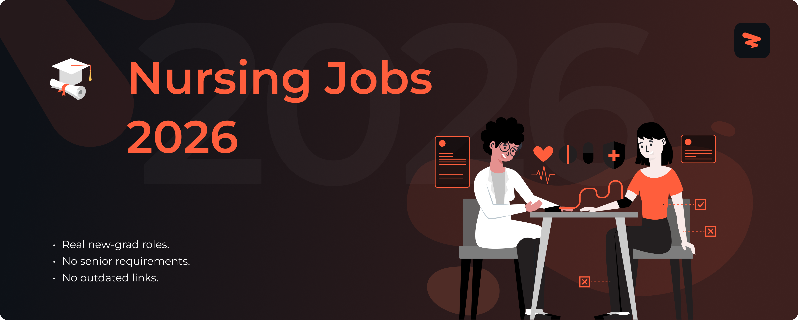

<!-- Banner -->

# Nursing Jobs 2026

 

<!-- Row 1: Job Stats (Custom Static Badges) -->

🚀 Real-time nursing, healthcare, and medical job listings from 9+ top institutions like Mayo Clinic, Cleveland Clinic, and Johns Hopkins Medicine. Updated every 24 hours with 285+ fresh opportunities for new graduates in registered nursing, allied health, and pharma.

🎯 Includes roles across trusted organizations like Mass General Brigham, Kaiser Permanente, and NewYork-Presbyterian Hospital.

> [!TIP]
> 🛠  Help us grow! Add new jobs by submitting an issue! View [contributing steps](CONTRIBUTING.md) here.

---

## Website & Autofill Extension

Explore Zapply's website and check out:

- Our chrome extension that auto-fills your job applications in seconds.
- A dedicated job board with the latest jobs for various types of roles.
- User account providing multiple profiles for different resume roles.
- Job application tracking with streaks to unlock commitment awards.

Experience an advanced career journey with us! 🚀

  
  &nbsp;&nbsp;&nbsp;&nbsp;
  

---

## Explore Around

Check out what we're doing on our socials, join our community to connect with fellow job seekers, get career advice, keep a lookout for free templates, and stay updated on the latest opportunities.

  
  &nbsp;&nbsp;
  
  &nbsp;&nbsp;
  
  &nbsp;&nbsp;
  
  &nbsp;&nbsp;
  

---

## More Resources

  
  &nbsp;&nbsp;
  
  &nbsp;&nbsp;
  

  
  &nbsp;&nbsp;
  
  &nbsp;&nbsp;
  

  
  &nbsp;&nbsp;
  
  &nbsp;&nbsp;
  

---

## Fresh Nursing Jobs 2026

### ⭐ **Elite Medical Centers** (61 positions)

<h4>⭐ <strong>Cleveland Clinic</strong> (47 positions)</h4>

| Role | Location | Level | Apply Now | Age |
|------|----------|-------|-----------|-----|
| Surgical Technologist | rymount Hospital |  |  | 1d |
| Ambulatory Surgery Assistant - Twinsburg ASC | Twinsburg Family Health Center |  |  | 1d |
| Medical Assistant - Medical Oncology | rtin Health North |  |  | 1d |
| Surgical Technologist | Medina Hospital |  |  | 1d |
| Surgical Technologist - Ambulatory Surgery Center | Beachwood Family Health and Surgery Center |  |  | 1d |
| Surgical Technologist- Cardiothoracic OR | Indian River Hospital |  |  | 1d |
| LPN Ambulatory - Cardiology | Akron General Medical Center |  |  | 1d |
| Surgical Technologist | Fairview Hospital |  |  | 1d |
| RN – Cardiac Cath Stress Lab | Hillcrest Hospital |  |  | 1d |
| Surgical Technologist - 0.8 FTE - 7a-3:30p - vary start | Akron General Medical Center |  |  | 1d |
| New Grad RN Resident - Hematology & Oncology Unit | Cleveland Clinic in Campus |  |  | 1d |
| Surgical Technologist - Orthopaedic OR | Cleveland Clinic in Campus |  |  | 1d |
| Surgical Technologist – Ambulatory Surgery Center | Multiple Cities |  |  | 1d |
| LPN Clinic - Colorectal Surgery | Florida Weston Hospital |  |  | 1d |
| LPN Clinic - Family Medicine | rtin Health at Tiffany |  |  | 1d |
| Diagnostic Medical Sonographer | Twinsburg Family Health Center |  |  | 1d |
| PRN LPN Ambulatory - Float North Pool | Florida Wellington |  |  | 1d |
| Patient Transporter 🏠 | Hillcrest Hospital |  |  | 1d |
| RN - Birthing Center 🏠 | Fairview Hospital |  |  | 1d |
| Clinical Technician - Med/Surg, Telemetry and Clinical Decision Units 🏠 | rtin Health North |  |  | 1d |
| RN - Vascular Surgery Stepdown Unit 🏠 | Cleveland Clinic in Campus |  |  | 1d |
| RN PRN - Cardiology Stepdown 🏠 | Cleveland Clinic in Campus |  |  | 1d |
| New Grad RN Resident - Vascular Surgery Stepdown Unit 🏠 | Cleveland Clinic in Campus |  |  | 1d |
| RN - Cardiovascular Stepdown Unit 🏠 | Cleveland Clinic in Campus |  |  | 1d |
| RN - Cardiovascular Stepdown 🏠 | Cleveland Clinic in Campus |  |  | 1d |
| Financial Navigator NE 🏠 | Mercy Hospital |  |  | 1d |
| RN - Dialysis 🏠 | Fairview Hospital |  |  | 1d |
| New Grad RN Resident - Cardiovascular Surgery Stepdown 🏠 | Cleveland Clinic in Campus |  |  | 1d |
| New Grad RN Resident – Cardiovascular Surgery Stepdown Unit 🏠 | Cleveland Clinic in Campus |  |  | 1d |
| RN - Cardiovascular Surgical Stepdown 🏠 | Cleveland Clinic in Campus |  |  | 1d |
| RN - Cardiovascular Surgery Stepdown 🏠 | Cleveland Clinic in Campus |  |  | 1d |
| Certified Surgical Technician 🏠 | rtin Health North |  |  | 1d |
| Experienced RN (PRN) - Cardiovascular Stepdown Unit | Cleveland Clinic in Campus |  |  | 1d |
| New Grad RN Resident - Cardiovascular Stepdown Unit | Cleveland Clinic in Campus |  |  | 1d |
| New Grad RN Resident - Thoracic Surgery Stepdown | Cleveland Clinic in Campus |  |  | 1d |
| New Grad RN Resident – Heart and Lung Transplant Unit | Cleveland Clinic in Campus |  |  | 1d |
| RN Ambulatory - Vascular Medicine | Cleveland Clinic in Campus |  |  | 1d |
| New Grad RN Resident - Cardiology Stepdown Unit | Cleveland Clinic in Campus |  |  | 1d |
| RN PRN - Cardiology Stepdown Unit | Cleveland Clinic in Campus |  |  | 1d |
| Clinical Technician - Cardiovascular ICU | Cleveland Clinic in Campus |  |  | 1d |
| Clinical Technician - Cardiovascular & Vascular Intensive Care Unit | Cleveland Clinic in Campus |  |  | 1d |
| Clinical Technician - Cardiovascular Intensive Care Units (CVICU) | Cleveland Clinic in Campus |  |  | 1d |
| RN - Cardiovascular Surgery | Cleveland Clinic in Campus |  |  | 1d |
| RN - Cardiology Stepdown Unit | Cleveland Clinic in Campus |  |  | 1d |
| RN Resident - Cardiology Stepdown J71 | Cleveland Clinic in Campus |  |  | 1d |
| RN - Cardiology Stepdown | Cleveland Clinic in Campus |  |  | 1d |
| Nursing Department Assistant - Geriatric Psych | Lutheran Hospital |  |  | 1d |

#### 🎓 **Stanford Health Care** (14 positions)

| Role | Location | Level | Apply Now | Age |
|------|----------|-------|-----------|-----|
| Vietnamese Medical Interpreter/Translator (Rotating Shift) 🏠 | 300P Hospital - B Central Core 100/200 - PALO ALTO |  |  | 3d |
| Relief Orthopedic Surgery APP - Nurse Practitioner or Physician Assistant 🏠 | Broadway Bldg A - REDWOOD CITY |  |  | 4d |
| Relief Housekeeping Assistant (multiple openings & shifts) 🏠 | 500P Hospital - J/K/L/M Patient - PALO ALTO |  |  | 1d |
| Advance Practice Provider (Physician Assistant) - Colorectal Surgical APP w/ First Assist- Easy Bay - Full Time, Days (8HRS) 🏠 | EMERYVILLE |  |  | 1d |
| Relief Cook (Multiple openings & shifts) 🏠 | 500P Hospital - J/K/L/M Patient - PALO ALTO |  |  | 1d |
| Clinical Nurse/Scrub Nurse (RN) - CVOR (0.90 FTE, 12-Hour Rotating Shifts, On-Call Required) | 500P Hospital - J/K/L/M Patient - PALO ALTO |  |  | 2d |
| Nurse Practitioner/Physician Assistant - Inpatient Urology | W. Las Positas Blvd. - PLEASANTON |  |  | 2d |
| MRI Technologist - Full Time, Rotating shifts (08HR) | US - Remote 🏠 |  |  | 2d |
| Security Officer II USAU | 300P Hospital - G/H Patient East Pavilion - PALO ALTO |  |  | 3d |
| Clinical Pharmacist - Transition of Care (Full-Time/Hybrid, 8-Hour Rotating Shifts) | 300P Hospital - B/C Patient West Pavilion - PALO ALTO |  |  | 3d |
| Pharmacy Technician - Peri-Op (Full-Time, 8-Hour Rotating Shifts) | 500P Hospital - J/K/L/M Patient - PALO ALTO |  |  | 3d |
| Clinical Pharmacist - Peri-Op (Full-Time, 8-Hour Rotating Shifts) | 500P Hospital - J/K/L/M Patient - PALO ALTO |  |  | 3d |
| Pharmacy Technician - Sterile Compounding (Full-Time, 8-Hour Rotating Shifts) | 500P Hospital - J/K/L/M Patient - PALO ALTO |  |  | 3d |
| Per Diem/Relief Clinical Pharmacist - Diabetes/Hypertension/Anticoagulation Ambulatory Care | Quarry - Hoover Pavilion - STANFORD |  |  | 3d |

### ✝️ **Faith-Based Health Systems** (55 positions)

<h4>✝️ <strong>Hospital Sisters Health System</strong> (17 positions)</h4>

| Role | Location | Level | Apply Now | Age |
|------|----------|-------|-----------|-----|
| Registered Nurse - ED/Critical Care | Litchfield, IL |  |  | 2d |
| Schedistrar - Cardiology | Effingham, IL |  |  | 3d |
| CVCU Registered Nurse (RN) | Springfield, IL |  |  | 1d |
| APP General Cardiology | Springfield, IL |  |  | 1d |
| Patient Care Assistant | Highland, IL |  |  | 1d |
| Security Officer | Green Bay, WI |  |  | 1d |
| Certified Surgical Technologist | O'Fallon, IL |  |  | 1d |
| Performance Excellence Strategist | Springfield, IL |  |  | 1d |
| Neonatal Nurse Practitioner (NNP) | Effingham, IL |  |  | 1d |
| Physician Assistant / Nurse Practitioner General Cardiology | Springfield, IL |  |  | 1d |
| Patient Care Assistant (PCA) - Medical/Surgical (Med/Surg) - Regional Float | Green Bay, WI |  |  | 1d |
| Registered Nurse (RN)-WI Regional Float -Med/Surg | Green Bay, WI |  |  | 1d |
| Supply Chain Technician | Springfield - St. John's Hospital |  |  | 1d |
| Switchboard Operator | O'Fallon - St. Elizabeth's Hospital |  |  | 1d |
| Registered Nurse (RN) - Medical/Surgical (Med/Surg) | Oconto Falls, WI |  |  | 1d |
| Quality Improvement Nurse | O'Fallon, IL |  |  | 1d |
| NICU Registered Nurse-Critical Care | Springfield, IL |  |  | 2d |

<h4>⛰️ <strong>Intermountain Health</strong> (38 positions)</h4>

| Role | Location | Level | Apply Now | Age |
|------|----------|-------|-----------|-----|
| Phlebotomist Specimen Processor | Thornton Clinic |  |  | 1d |
| Phlebotomist Specimen Processor | Central Park Clinic - OB-GYN |  |  | 1d |
| Phlebotomist Specimen Processor Float PRN | Saint Joseph Hospital |  |  | 1d |
| Phlebotomist Specimen Processor Float PRN | Platte Valley Hospital |  |  | 1d |
| Phlebotomist Specimen Processor | Copperleaf Clinic Primary Care |  |  | 1d |
| Patient Safety Attendant | St James Hospital |  |  | 1d |
| Audiology Hearing Screening Assistant PRN | Intermountain Health Orem Community Hospital |  |  | 1d |
| Phlebotomist | South Jordan Clinic |  |  | 1d |
| Clinical Mental Health Professional - PRN | Saint Joseph Hospital |  |  | 1d |
| Environmental Services Tech Housekeeping | Intermountain Health St George Regional Hospital |  |  | 1d |
| Patient Service Representative | Roy Clinic |  |  | 1d |
| Cardiothoracic Surgery Physician | Grand Junction Cardiothorasic |  |  | 1d |
| Clinical Lab Assistant PRN | Intermountain Health Utah Valley Hospital |  |  | 1d |
| Critical Care Tech - Emergency | Intermountain Health Intermountain Medical Center |  |  | 1d |
| Janitor | St James Hospital |  |  | 1d |
| Invasive Cardiovascular Tech | Platte Valley Hospital |  |  | 1d |
| Medical Assistant Primary Care Float | Pahrump Clinic |  |  | 1d |
| Medical Assistant Anticoagulation | Intermountain Health St George Regional Hospital |  |  | 1d |
| Medical Assistant Family Medicine | Fillmore Clinic |  |  | 1d |
| Medical Assistant Float Pool PRN | Intermountain Health Cedar City Hospital |  |  | 1d |
| Medical Assistant | Jerry and Kathleen Grundhofer Clinic |  |  | 1d |
| Medical Assistant ENT | Intermountain Health McKay-Dee Hospital |  |  | 1d |
| NeuroHospitalist | St Vincent Regional Neuroscience Center |  |  | 1d |
| Registered Nurse Avenues OBGYN Clinic | Avenues Womens Center |  |  | 1d |
| Medical Assistant Vascular and Vein | Intermountain Health Intermountain Medical Center |  |  | 1d |
| Patient Serivce Representative | Good Samaritan Medical Office Pavilion |  |  | 1d |
| Patient Service Representative | St. rys Regional Hospital |  |  | 1d |
| Maintenance Engineer | Intermountain Health Utah Valley Hospital |  |  | 1d |
| Medical Assistant InstaCare PRN | North Ogden Clinic |  |  | 1d |
| Environmental Services Technician Housekeeper | Intermountain Health Intermountain Medical Center |  |  | 1d |
| Security Officer | Intermountain Health LDS Hospital |  |  | 1d |
| Environmental Services Tech Housekeeping | Intermountain Health Orem Community Hospital |  |  | 1d |
| Registered Nurse Cardiac Neuro Intermediate Care | Intermountain Health Lutheran Hospital |  |  | 1d |
| Charge Nurse Surgical Trauma | Intermountain Health Lutheran Hospital |  |  | 1d |
| Medical Oncologist | St. rys Regional Hospital |  |  | 1d |
| Primary Care Physician Grand Junction Downtown | Grand Junction Downtown Clinic |  |  | 1d |
| Security Officer | Good Samaritan Hospital |  |  | 1d |
| Maintenance Worker | Intermountain Health Logan Regional Hospital |  |  | 1d |

### 🎓 **Academic Medical Centers** (15 positions)

#### 🏥 **VCU Health** (15 positions)

| Role | Location | Level | Apply Now | Age |
|------|----------|-------|-----------|-----|
| Licensed Behavioral Health Clinician- Adult Physical Medicine & Rehab | Richmond, VA |  |  | 1d |
| Respiratory Therapist - CHOR Pavilion Brook Rd - Weekend Program (WEP) - Days | Multiple Cities |  |  | 1d |
| Physical Therapist - Acute Care Pediatrics | Richmond, VA |  |  | 1d |
| Medic - Hospital at Home - PRN - Day/Evenings | Richmond, VA |  |  | 1d |
| Registered Nurse (RN) - Hospital at Home - PRN - Days/ Evenings | Richmond, VA |  |  | 1d |
| Licensed Practical Nurse (LPN) - COVA Care Clinic - Days | Richmond, VA |  |  | 1d |
| Registered Nurse (RN) - Emergency Dept - PRN | South Hill, VA |  |  | 1d |
| Patient Care Tech - Epilepsy Monitoring Unit - Rotating | Richmond, VA |  |  | 1d |
| Patient Care Tech - Neurosurgery Progressive Care - Rotating | Richmond, VA |  |  | 1d |
| Patient Care Tech - Comprehensive Liver Intermediate Care - Rotating | Richmond, VA |  |  | 1d |
| Registered Nurse (RN) Neuro - Main Operating Room (OR) - Days | Richmond, VA |  |  | 1d |
| Registered Nurse (RN) - Main Operating Room (OR) - Rotating - PRN | Richmond, VA |  |  | 1d |
| Registered Nurse (RN) - Burn ICU/Progressive Care - Rotating | Richmond, VA |  |  | 1d |
| Patient Care Technician - Medical Surgical Progressive Care Unit - Days | Richmond, VA |  |  | 2d |
| Unit Secretary - NICU - Rotating | Richmond, VA |  |  | 2d |

### 🔗 **Integrated Health Networks** (32 positions)

<h4>💙 <strong>Allina Health</strong> (26 positions)</h4>

| Role | Location | Level | Apply Now | Age |
|------|----------|-------|-----------|-----|
| CT Technologist 🏠 | Abbott Northwestern Hospital |  |  | 1d |
| Interventional Radiology Technologist 🏠 | Abbott Northwestern Hospital |  |  | 1d |
| Diagnostic Sonographer 🏠 | Abbott Northwestern - WestHealth |  |  | 1d |
| MRI Technologist 🏠 | United Hospital |  |  | 1d |
| Physical Therapist, Cancer Rehab & Lymphedema Care 🏠 | Courage Kenny Sports and Physical Therapy Woodbury |  |  | 1d |
| Physical Therapist - Cancer Rehab and Lymphedema 🏠 | Courage Kenny Sports and Physical Therapy Woodbury |  |  | 1d |
| Physical Therapist - Lymphedema and Pelvic Health 🏠 | Courage Kenny Sports and Physical Therapy Apple Valley |  |  | 1d |
| Phlebotomist and EKG Assistant 🏠 | United Hospital |  |  | 1d |
| Medical Assistant 🏠 | Allina Health Clinic Eden Prairie |  |  | 1d |
| CT Technologist 🏠 | United Hospital |  |  | 1d |
| RN Mental Health - St Paul 🏠 | Allina Health Mental Health and Addiction Services United Clinic |  |  | 1d |
| Laboratory Assistant 🏠 | St Francis Regional Medical Center |  |  | 1d |
| Team Care Provider - Family Nurse Practitioner or Physician Assistant 🏠 | Allina Health ndana Square Clinic |  |  | 1d |
| Nursing Assistant- Intermediate Care/Medical-Surgical 🏠 | Abbott Northwestern Hospital |  |  | 1d |
| Cardiovascular Procedural Technologist 🏠 | Mercy Hospital |  |  | 1d |
| Cardiac Sonographer 🏠 | Waconia Ridgeview Medical |  |  | 1d |
| Cardiac Sonographer 🏠 | United Hospital |  |  | 1d |
| Licensed Practical Nurse-Hospital | New Ulm Medical Center |  |  | 1d |
| Cardiac Sonographer | Allina Health Centennial Lakes Clinic Edina |  |  | 1d |
| Dietary Aide | Cambridge Medical Center |  |  | 1d |
| Cardiac Sonographer | Allina Health Clinic Eden Prairie |  |  | 1d |
| Cardiac Sonographer-Mobile | Abbott Northwestern - WestHealth |  |  | 1d |
| Cardiac Sonographer | Abbott Northwestern Hospital |  |  | 1d |
| Surgical Technologist | United Hospital |  |  | 1d |
| RN Critical Care | New Ulm Medical Center |  |  | 1d |
| Registered Nurse Neurology | United Hospital |  |  | 1d |

#### 🏨 **Endeavor Health** (6 positions)

| Role | Location | Level | Apply Now | Age |
|------|----------|-------|-----------|-----|
| RN - 5E Neuro/Stroke/Tele - Nights | SWH Swedish Hospital Chicago |  |  | 1h |
| Orders Management Assistant | NCH 800 W Central Rd Arlington Heights |  |  | 1h |
| Medical Assistant/Patient Support Assistant (MA/PSA) - Immediate Care - Skokie (20 hours) | NSO Skokie |  |  | 1h |
| Hospital Operator - Hospital Operators - Per Diem- Glenview, IL ( Evening) | GBH Glenbrook Hospital Glenview |  |  | 1h |
| Medical Assistant/Patient Support Assistant(MA/PSA) - Immediate Care - Niles (Per Diem) | NSO Niles |  |  | 1h |
| Systems Engineer II - Data Center Engineering | NSO Corporate Office Skokie |  |  | 1h |

---

## Become a Contributor

Add new jobs to our listings keeping in mind the following:

- Located in the US, Canada, or Remote.
- Openings are currently accepting applications and not older than 1 week.
- Create a new issue to submit different job positions.
- Update a job by submitting an issue with the job URL and required changes.

Our team reviews within 24-48 hours and approved jobs are added to the main list!

Questions? Create a miscellaneous issue, and we'll assist! 🙏

<h2>📁 <strong>Archived Data Jobs – 107 (7+ days old)</strong> - Click to Expand</h2>

Either still hiring or useful for research.

### **Archived Job Stats**

📁 **Total Jobs:** 107 positions
🏢 **Companies:** 9 companies

### ⭐ **Elite Medical Centers** (1 position)

#### 🎓 **Stanford Health Care** (1 position)

| Role | Location | Level | Apply Now | Age |
|------|----------|-------|-----------|-----|
| Clinical Lab Scientist HLA Lab - Day Shift 🏠 | Multiple Cities |  |  | 1w |

### ✝️ **Faith-Based Health Systems** (5 positions)

#### ✝️ **Hospital Sisters Health System** (5 positions)

| Role | Location | Level | Apply Now | Age |
|------|----------|-------|-----------|-----|
| Medical Assistant (MA)-Family Medicine | Greenville, IL |  |  | 1w |
| Medical Assistant (MA)-Family Health | Greenville, IL |  |  | 1w |
| Medical Assistant (MA)-Outpatient Specialty Clinic | Litchfield - St. Francis Hospital |  |  | 1w |
| Registered Nurse (RN) - Physician Practice Cardiology | Decatur, IL |  |  | 2w |
| Registered Nurse (RN), Emergency Room | Highland, IL |  |  | 2w |

### 🎓 **Academic Medical Centers** (33 positions)

<h4>📚 <strong>University of Rochester Medical Center</strong> (26 positions)</h4>

| Role | Location | Level | Apply Now | Age |
|------|----------|-------|-----------|-----|
| Primary Care - Family Medicine - Medical Associates of Henrietta - LPN 2, Outpt | Medical Associates of Henrietta |  |  | 1w |
| Dialysis (Acute Unit) - Registered Nurse 2, Inpatient | Strong Memorial Hospital |  |  | 1w |
| AC2 – Esophageal Diagnostic Procedural Lab (Motility) – Level | Strong Memorial Hospital |  |  | 1w |
| Neurology—Ambulatory Clinics—Float to multiple divisions within Neurology OPD – LPN | Building C |  |  | 1w |
| CPEP - Comprehensive Psychiatric Emergency Program – LPN | Strong Memorial Hospital |  |  | 1w |
| Primary Care-Internal Medicine-LPN Proficient Eastside Internal Medicine | Eastside al Medicine |  |  | 1w |
| 83400 Medical Intensive Care Unit MICU - RN Level 1 or | Strong Memorial Hospital |  |  | 1w |
| 31800 - Kessler Family Burn/Trauma ICU - Registered Nurse 1 or 2, Inpatient | Strong Memorial Hospital |  |  | 1w |
| 81400 Surgical Intensive Care Unit - Registered Nurse - Level 1 or | Strong Memorial Hospital |  |  | 1w |
| University Gynecology and Childbirth Associates (UGCA) - Registered Nurse | Canal View Boulevard |  |  | 1w |
| 71600 - Medical ICU Unit – Registered Nurse 1 or 2, Inpatient | Strong Memorial Hospital |  |  | 1w |
| Ambulatory Sawgrass - Operating Room – Surgical Technician | Multiple Cities |  |  | 1w |
| Hospital Medicine APP - Nurse Practitioner/Physician Assistant | Strong Memorial Hospital |  |  | 1w |
| Radiation Oncology Nurse at Strong – Wilmot Cancer Institute – RN 2, Ambulatory | James P. Wilmot Cancer Center |  |  | 1w |
| 71600 - MICU ICU - LPN 2 Inpt | Strong Memorial Hospital |  |  | 1w |
| Comprehensive Psychiatric Emergency Program (CPEP) - Psychiatric Nurse Practitioner | Strong Memorial Hospital |  |  | 1w |
| Valve clinic/Structural heart team - Nurse Practitioner/Physician Assistant ( | Strong Memorial Hospital |  |  | 1w |
| Center for Perioperative Medicine (CPM) (Part Time)– Nurse Practitioner/Physician Assistant | Strong Memorial Hospital |  |  | 1w |
| Cardiac Cath & Electrophysiology Lab – Nurse Navigator | Strong Memorial Hospital |  |  | 1w |
| Center for Perioperative Medicine (CPM Clinic) -Registered Nurse 2, Outpatient | Multiple Cities |  |  | 1w |
| 42800 – Cardiac Intensive Care (CICU) – Registered Nurse 2, Inpatient | Strong Memorial Hospital |  |  | 1w |
| Neonatal Intensive Care (NICU) (hiring now for summer 2026 start) - Registered Nurse 1, Inpt | Strong Memorial Hospital |  |  | 1w |
| 81200 - Neuromedicine ICU - LPN 2 Inpt | Strong Memorial Hospital |  |  | 2w |
| Emergency Department - LPN 2 Inpt | Strong Memorial Hospital |  |  | 2w |
| Ambulatory Vascular Clinic – RN | Canal View Boulevard |  |  | 2w |
| Employee Health – RN | Strong Memorial Hospital |  |  | 2w |

#### 🏥 **VCU Health** (7 positions)

| Role | Location | Level | Apply Now | Age |
|------|----------|-------|-----------|-----|
| Laboratory Scientist/MLS/CLS/MT Supr – Microbiology – Days | Richmond, VA |  |  | 1w |
| Clinical Nurse Administrator (RN) - Tappahannock - Part-Time Varied | Tappahannock, VA |  |  | 1w |
| Driver – Security Department – Part-Time and Full-Time – Various shifts | Richmond, VA |  |  | 1w |
| Certified Medical Assistant (CMA)- Massey Cancer Center- PRN | Richmond, VA |  |  | 1w |
| Registered Nurse (RN) - Massey Comprehensive Cancer Center - Days | Richmond, VA |  |  | 1w |
| Laboratory Scientist/MLS/CLS/MT – Blood Bank – Evenings | Richmond, VA |  |  | 1w |
| Laboratory Scientist/MLS/CLS/MT - Blood Bank - Part-Time (20 hrs/wk) | Richmond, VA |  |  | 3w |

### 🔗 **Integrated Health Networks** (29 positions)

<h4>🏨 <strong>Endeavor Health</strong> (29 positions)</h4>

| Role | Location | Level | Apply Now | Age |
|------|----------|-------|-----------|-----|
| RN - Critical Care - Edward Hospital | EDH in Hospital Naperville |  |  | 2w |
| RN Weekender - CNICU - Days | EDH in Hospital Naperville |  |  | 2w |
| RN - Ortho/Spine - Nights | EDH in Hospital Naperville |  |  | 2w |
| Cardiac Sonographer | Multiple Cities |  |  | 2w |
| Radiology Technologist- Cardiac Cath Lab | Multiple Cities |  |  | 2w |
| Mammography Technologist | Multiple Cities |  |  | 2w |
| Radiologic Technologist I - Chicago and North Suburbs | EVH Evanston Hospital |  |  | 2w |
| Radiologic Technologist I (Northwestern Suburbs) | NCH 800 W Central Rd Arlington Heights |  |  | 2w |
| Radiologic Technologist I (Western Suburbs) | EDH in Hospital Naperville |  |  | 2w |
| MRI Technologist | EVH Evanston Hospital |  |  | 2w |
| CT Technologist I - Multiple Locations | Multiple Cities |  |  | 2w |
| Surgical Technologist- Multiple Campuses | Multiple Cities |  |  | 2w |
| Medical Lab Scientist - Multiple Campuses | Multiple Cities |  |  | 2w |
| Registered Nurse - OR - Multiple Locations | GBH Glenbrook Hospital Glenview |  |  | 2w |
| Registered Nurse - Emergency Department - Multiple Campuses - Nights | Multiple Cities |  |  | 2w |
| Registered Nurse - Multiple Locations | EDH in Hospital Naperville |  |  | 2w |
| Registered Nurse - Multiple Locations | Multiple Cities |  |  | 2w |
| Medical Assistant (Northwestern Suburbs - Multiple Locations) | Multiple Cities |  |  | 2w |
| Medical Assistant (Western Suburbs - Multiple Locations) | Multiple Cities |  |  | 2w |
| Physical Therapist I (Outpatient- Northwest Suburbs) | Multiple Cities |  |  | 2w |
| Physical Therapist I (Outpatient - Western Suburbs) | Multiple Cities |  |  | 2w |
| Physical Therapist I - PRN (Inpatient and Outpatient - Multiple Locations) | Multiple Cities |  |  | 2w |
| Registered Nurse-Emergency Department-Night | HPH Highland Park Hospital |  |  | 2w |
| Registered Nurse-Emergency Department-Nights | HPH Highland Park Hospital |  |  | 2w |
| Occupational Therapist I - Inpatient/Outpatient- Multiple Locations | Multiple Cities |  |  | 2w |
| Physical Therapist Assistant- Inpatient and Outpatient- Multiple Locations | Multiple Cities |  |  | 2w |
| Clinical Nurse Educator - Department Based - CVICU - Days | GBH Glenbrook Hospital Glenview |  |  | 1mo |
| Patient Access Representative | GBH Glenbrook Hospital Glenview |  |  | 1mo |
| Medical Laboratory Scientist - Core Lab - Evenings | EMH in Hospital Elmhurst |  |  | 1mo |

🎯 **285 current opportunities from 9 elite companies.**

**Found this helpful? Give it a ⭐ to support us!**

*Not affiliated with any companies listed. All applications redirect to official career pages.*

**Last Updated:** January 16, 2026 • **Next Update:** Daily at 9 AM UTC 
