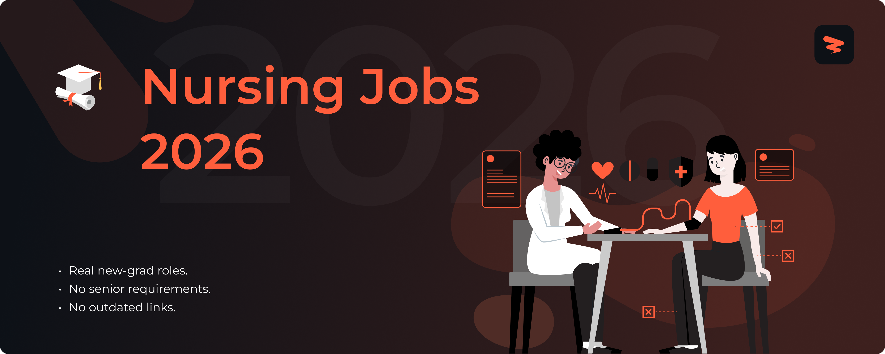
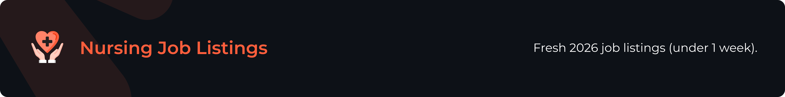

<!-- Banner -->

# Healthcare Jobs 2026

🚀 Real-time healthcare, nursing, and medical jobs from 16+ top companies and healthcare facilities. Updated every 15 minutes with 1307+ fresh opportunities for new graduates, nursing students, and entry-level healthcare professionals.

🎯 Includes roles across top healthcare systems, hospital networks, medical staffing agencies, and clinical settings.

> [!TIP]
> 🛠 Help us grow! Add new jobs by submitting an issue! View contributing steps [here](CONTRIBUTING-GUIDE.md).

---

## Website & Autofill Extension

Explore Zapply's website and check out:

- Our chrome extension that auto-fills your job applications in seconds.
- A dedicated job board with the latest jobs for various types of roles.
- User account providing multiple profiles for different resume roles.
- Job application tracking with streaks to unlock commitment awards.

Experience an advanced career journey with us! 🚀

  
  &nbsp;&nbsp;&nbsp;&nbsp;
  

---

## Explore Around

Connect and seek advice from a growing network of fellow students and new grads.

  
  &nbsp;&nbsp;
  
  &nbsp;&nbsp;
  

---

## Fresh Healthcare Jobs 2026

<h3>🏥 <strong>Registered Nurse</strong></h3>

| Company | Role | Location | Posted | **Apply** |
|---------|------|----------|--------|----------|
| 🏢 **WVU Medicine** | RN- Fulltime- Nightshift- 3 West | Princeton Communi... | 16m |  |
| 🏢 **Ochsner Health** | RN- OLGMC 8T Post Op- Part Time Nights | Acadiana Region -... | 18m |  |
| 🏢 **Ochsner Health** | RN Acute Dialysis - Jeff Hwy - Full Time - Nights | New Orleans Regio... | 18m |  |
| 🏢 **Ochsner Health** | RN or LPN- Vaccine Coordinator- Peds Clinic - Baton Rouge | Baton Rouge Regio... | 18m |  |
| 🏢 **Cleveland Clinic** | New Grad. RN Resident - Rehabilitation Unit | Mercy Hospital | 18m |  |
| 🏢 **Cleveland Clinic** | RN - Surgical Intensive Care Unit/Cardiovascular Intensive Care Unit | Florida Weston Ho... | 18m |  |
| 🏢 **Cleveland Clinic** | New Grad RN Resident – Med Surg | Hillcrest Hospital | 18m |  |
| 🏢 **Banner Health** | Registered Nurse RN Cath Lab | BUMC Phoenix | 2d |  |
| 🏢 **Banner Health** | Registered Nurse RN Progressive Care Unit PCU Float Pool | 2 Locations | 2d |  |
| 🏢 **Banner Health** | Registered Nurse RN Resource Oncology | Banner MD Anderso... | 2d |  |
| 🏢 **Nationwide Children's** | Foster Care and Child Assessment Ambulatory RN | 4 Locations | 2d |  |
| 🏢 **Saint Luke's Health System** | Occupational Therapist PRN - Home Health | Chillicothe, MO | 2d |  |
| 🏢 **Saint Luke's Health System** | Registered Nurse I Residency Program Progressive Care Unit | Overland Park, KS | 2d |  |
| 🏢 **Saint Luke's Health System** | Registered Nurse - Cath Lab | Lees Summit, MO | 2d |  |
| 🏢 **Geisinger Health** | RN - Registered Nurse - Orthopedic and Adult Advanced Acute Care Unit | Scranton, PA | 2d |  |
| 🏢 **Geisinger Health** | RN- Specialty Registered Nurse - Cardiac Rehab | Lewistown, PA | 2d |  |
| 🏢 **Geisinger Health** | RN - Registered Nurse Ambulatory Surgery - Operating Room | Danville, PA | 2d |  |
| 🏢 **Sharp Healthcare** | LVN - Pediatrics - SRS Rancho Bernardo - Part Time - Day Shift | San Diego, CA | 2d |  |
| 🏢 **Sharp Healthcare** | Nurse Residency Program   New Grad RN   Summer 2026 Start | San Diego, CA | 2d |  |
| 🏢 **Sharp Healthcare** | RN - 3E GI/GU PCU - Sharp Grossmont Hospital - Nights - Full Time - May be eligible for Relocation Incentive | La Mesa, CA | 2d |  |
| 🏢 **Mass General Brigham** | Registered Nurse (RN)   Center for Perioperative Care   MGH | MA | 2d |  |
| 🏢 **Mass General Brigham** | RN - Inpatient Oncology - MGH | MA | 2d |  |
| 🏢 **Intermountain Health** | EMT/AEMT PRN | Intermountain Hea... | 2d |  |
| 🏢 **Intermountain Health** | Registered Nurse IMED Vascular and Vein Clinic | Intermountain Hea... | 2d |  |
| 🏢 **Intermountain Health** | Registered Nurse Thoracic Intensive Care Unit | Intermountain Hea... | 2d |  |
| 🏢 **WVU Medicine** | RN Hemodialysis - 7am-7pm | Princeton Communi... | 3d |  |
| 🏢 **WVU Medicine** | RN 4 East Inpatient Oncology / Med Surg Night Shift | Princeton Communi... | 3d |  |
| 🏢 **Nationwide Children's** | Ambulatory RN - Outpatient Psychiatry (Behavioral Health Pavilion) | Main Campus, OH | 3d |  |
| 🏢 **Nationwide Children's** | Ambulatory RN- Allergy Clinic | 4 Locations | 3d |  |
| 🏢 **Mass General Brigham** | RN Neuro ICU -MGH | MA | 3d |  |

Apply for more jobs at

<h3>⚕️ <strong>Nurse Practitioner</strong></h3>

| Company | Role | Location | Posted | **Apply** |
|---------|------|----------|--------|----------|
| 🏢 **Nationwide Children's** | Nurse Practitioner - Specialty Primary Care | Main Campus, OH | 18m |  |
| 🏢 **Ochsner Health** | Occupational Therapist - Inpatient - Ochsner Medical Center - Baton Rouge | Baton Rouge Regio... | 2d |  |
| 🏢 **Ochsner Health** | Physical Therapist- Inpatient- Part Time | Acadiana Region -... | 2d |  |
| 🏢 **Ochsner Health** | Pharmacist- OALH Inpatient Pharmacy- Full Time | Acadiana Region -... | 2d |  |
| 🏢 **Geisinger Health** | Physician Assistant or Nurse Practitioner - Outpatient Hem/Onc $10k Recruitment Incentive | Barre, PA, PA | 2d |  |
| 🏢 **Geisinger Health** | Nurse Practitioner or Physician Assistant   Neurology | Danville, PA | 2d |  |
| 🏢 **Geisinger Health** | Pharmacy Technician I--inpatient | Danville, PA | 2d |  |
| 🏢 **Mass General Brigham** | NP - Hospital Medicine Unit, Nights - MGH | MA | 2d |  |
| 🏢 **Mass General Brigham** | NP - Hospital Medicine Unit - MGH | MA | 2d |  |
| 🏢 **Intermountain Health** | Inpatient Registered Clinical Dietitian | Intermountain Hea... | 2d |  |
| 🏢 **Intermountain Health** | Inpatient Physical Therapist | Intermountain Hea... | 2d |  |
| 🏢 **Cleveland Clinic** | Clinical Pharmacist - Inpatient | Akron General Med... | 2d |  |
| 🏢 **Cleveland Clinic** | Advanced Practice Provider (NP/PA/CNS) - Brain Health Research Study I | 2 Locations | 2d |  |
| 🏢 **Mass General Brigham** | Physical Therapist I - Inpatient | MA | 3d |  |
| 🏢 **Intermountain Health** | Inpatient Behavioral Health Occupational Therapist | Intermountain Hea... | 6d |  |
| 🏢 **Cleveland Clinic** | Advanced Practice Provider (NP/PA/CNS)-Outpatient Pulmonary Medicine/Sleep Medicine I (South Region) | Akron General Med... | 6d |  |
| 🏢 **Saint Luke's Health System** | Inpatient Pharmacy Tech | Kansas City, MO | 1w |  |
| 🏢 **Montefiore Medical Center** | Nurse Practitioner | 111 East 210th St... | 1w |  |

Apply for more jobs at

<h3>💉 <strong>Licensed Practical Nurse</strong></h3>

| Company | Role | Location | Posted | **Apply** |
|---------|------|----------|--------|----------|
| 🏢 **Ochsner Health** | LPN- Ortho clinic- Baton Rouge | Baton Rouge Regio... | 18m |  |
| 🏢 **Geisinger Health** | LPN - Licensed Practical Nurse - Endoscopy | Barre, PA, PA | 18m |  |
| 🏢 **Geisinger Health** | LPN - Licensed Practical Nurse - General Pediatrics | Port Matilda, PA | 18m |  |
| 🏢 **Banner Health** | Licensed Practical Nurse LPN MedSurg Medical Oncology Telemetry | Banner North Colo... | 2d |  |
| 🏢 **Banner Health** | Licensed Practical Nurse LPN MedSurg Surgical Ortho Neuro | Banner North Colo... | 2d |  |
| 🏢 **Nationwide Children's** | Ambulatory LPN- Infectious Disease Clinic | Main Campus, OH | 2d |  |
| 🏢 **Ochsner Health** | LPN - ENT Clinic - Full Time - Jeff Hwy | New Orleans Regio... | 2d |  |
| 🏢 **Ochsner Health** | LPN - Full Time - GI Clinic | Central Mississip... | 2d |  |
| 🏢 **Geisinger Health** | LPN - Licensed Practical Nurse - Primary Care | Selinsgrove, PA | 2d |  |
| 🏢 **Sharp Healthcare** | LVN - Telemetry 2S - Grossmont Hospital - Nights - FT | La Mesa, CA | 2d |  |
| 🏢 **Cleveland Clinic** | LPN - Neuro | Cleveland Clinic ... | 2d |  |
| 🏢 **Cleveland Clinic** | LPN – Emergency Department | South Pointe Hosp... | 2d |  |
| 🏢 **Cleveland Clinic** | LPN Clinic - Breast Surgery | Florida Weston Ho... | 3d |  |
| 🏢 **Nationwide Children's** | Ambulatory LPN - Hilltop Primary Care | 2857 West Broad S... | 6d |  |
| 🏢 **WVU Medicine** | Intake LPN Home Health and Hospice | Monongalia County WV | 6d |  |
| 🏢 **Banner Health** | LPN Emergency Department | BUMC Tucson | 1w |  |
| 🏢 **Saint Luke's Health System** | Licensed Practical Nurse - Float | Kansas City, MO | 1w |  |
| 🏢 **Sharp Healthcare** | SRS - Medical Specialty Mgmt.- LVN -Full Time – Day Shift | Chula Vista, CA | 1w |  |
| 🏢 **Intermountain Health** | LPN Care Coordinator | Peaks Regional Of... | 1w |  |
| 🏢 **Intermountain Health** | Licensed Practical Nurse Medical Oncology | Intermountain Hea... | 1w |  |
| 🏢 **Nationwide Children's** | LPN-Night Shift-Homecare Private Duty | 255 E. Main St, OH | 1w |  |
| 🏢 **Saint Luke's Health System** | Licensed Practical Nurse - Skilled Nursing | Kansas City, MO | 1w |  |
| 🏢 **Sharp Healthcare** | SRS – Medical Specialty Mgmt. – LVN -Per Diem-Day Shift | San Diego, CA | 1w |  |
| 🏢 **Intermountain Health** | Licensed Practical Nurse Residential Living | Holy Rosary Hospital | 1w |  |
| 🏢 **Saint Luke's Health System** | Telehealth Assistant LPN | Kansas City, MO | 1w |  |

Apply for more jobs at

<h3>🩺 <strong>Specialized Care</strong></h3>

| Company | Role | Location | Posted | **Apply** |
|---------|------|----------|--------|----------|
| 🏢 **Nationwide Children's** | Social Worker MSW - NCH NICU Riverside | 3535 Olentangy Ri... | 18m |  |
| 🏢 **Ochsner Health** | CNA - Risk Sitter - FT - Nights - Kenner | New Orleans Regio... | 18m |  |
| 🏢 **Ochsner Health** | CNA - Risk Sitter - FT - Days - Kenner | New Orleans Regio... | 18m |  |
| 🏢 **Ochsner Health** | CNA/Patient Care Assistant - Cardiology-- Days | Northshore Region... | 2d |  |
| 🏢 **Saint Luke's Health System** | Nurse Aide - Home Health CNA | KS | 2d |  |
| 🏢 **Saint Luke's Health System** | Certified Nursing Assistant | Garnett, KS | 2d |  |
| 🏢 **Geisinger Health** | Patient Care Technician (Advanced Acute Care Medical Unit, GP3) - No CNA Cert Required - Day/Evening Rotation Shift | Danville, PA | 2d |  |
| 🏢 **Geisinger Health** | Patient Care Technician (Advanced Acute Care Medical, AP5) - No CNA Cert Required - Day/Evening Rotation Shift | Danville, PA | 2d |  |
| 🏢 **Intermountain Health** | Patient Care Tech CNA BMT Oncology | Intermountain Hea... | 2d |  |
| 🏢 **Intermountain Health** | Patient Care Tech (CNA) - T5/Cardiac | Intermountain Hea... | 2d |  |
| 🏢 **Cleveland Clinic** | Patient Care Nurse Assistant (PCNA) - Cardiac ICU | Fairview Hospital | 2d |  |
| 🏢 **Cleveland Clinic** | Patient Care Nurse Assistant (PCNA) - Cardiovascular Telemetry | Cleveland Clinic ... | 2d |  |
| 🏢 **Cleveland Clinic** | Patient Care Nurse Assistant (PCNA) - Cardiology Stepdown Unit | Cleveland Clinic ... | 2d |  |
| 🏢 **Geisinger Health** | Patient Care Technician Per Diem (Emergency Department) - No CNA Cert Required | Coal Township, PA | 3d |  |
| 🏢 **Intermountain Health** | Patient Care Technician CNA Ortho | Intermountain Hea... | 3d |  |
| 🏢 **Nationwide Children's** | Medical Social Worker - NICU (PFK) | 525 E. Mound St, OH | 1w |  |
| 🏢 **Banner Health** | Patient Care Assistant CNA LNA Medical Surgical | BUMC Tucson | 1w |  |
| 🏢 **Banner Health** | Certified Patient Care Assistant CNA LNA Medical Surgical | BUMC Tucson | 1w |  |
| 🏢 **Banner Health** | Certified Patient Care Assistant CNA LNA Float Pool | BUMC Phoenix | 1w |  |
| 🏢 **Saint Luke's Health System** | Certified Nursing Assistant | Kansas City, MO | 1w |  |

Apply for more jobs at

<h3>👨‍⚕️ <strong>Medical Support</strong></h3>

| Company | Role | Location | Posted | **Apply** |
|---------|------|----------|--------|----------|
| 🏢 **WVU Medicine** | Graduate Nurse - ICU/CCU | Princeton Communi... | 16m |  |
| 🏢 **Ochsner Health** | OMC-Patient Care Technician-Nights | New Orleans Regio... | 2d |  |
| 🏢 **Ochsner Health** | Patient Care Technician (PCT) - Cardio / Med-Surg Unit- Full Time- Days | New Orleans Regio... | 2d |  |
| 🏢 **WVU Medicine** | Graduate Nurse -  3 South | Princeton Communi... | 3d |  |
| 🏢 **Geisinger Health** | Patient Care Technician - Evening/Nights - Progressive Care Unit | Scranton, PA | 1w |  |

Apply for more jobs at

<h3>🏥 <strong>Healthcare & Clinical</strong></h3>

| Company | Role | Location | Posted | **Apply** |
|---------|------|----------|--------|----------|
| 🏢 **Nationwide Children's** | Patient Access Representative-Radiology Administration | Main Campus, OH | 18m |  |
| 🏢 **Mass General Brigham** | Medical Assistant, Orthopedics | 3 Locations | 18m |  |
| 🏢 **Mass General Brigham** | Physical Therapist OP Durham Clinic | NH | 18m |  |
| 🏢 **Mass General Brigham** | MGH Providence College Nursing Academy | MA | 18m |  |
| 🏢 **Intermountain Health** | Clinical Informatics Analyst-Pharmacist | Lake Park Building | 18m |  |
| 🏢 **Cleveland Clinic** | Patient Care Nursing Assistant – SICU/MICU | Akron General Med... | 18m |  |
| 🏢 **Cleveland Clinic** | Radiology Technologist Weekender | Florida Weston Ho... | 18m |  |
| 🏢 **Cleveland Clinic** | MRI Technologist - Weekender | Florida Weston Ho... | 18m |  |
| 🏢 **Banner Health** | Medical Assistant Cardiology | Banner Health Cli... | 2d |  |
| 🏢 **Banner Health** | Registered  Dietitian | BUMC Phoenix | 2d |  |
| 🏢 **Banner Health** | Acute Pharmacy Technician | Wyoming Medical C... | 2d |  |
| 🏢 **KBR** | Special Operations Performance Dietitian JFKSWCS Ft. Bragg, NC | Fort Liberty | 2d |  |
| 🏢 **Nationwide Children's** | Ambulatory Patient Access Rep-Orthopedic Clinic | Main Campus, OH | 2d |  |
| 🏢 **Nationwide Children's** | Ambulatory Patient Access Representivitve - CASD | 7223 Maumee Weste... | 2d |  |
| 🏢 **Ochsner Health** | Medical Assistant - ENT Clinic - Full Time - Jeff Hwy | New Orleans Regio... | 2d |  |
| 🏢 **Ochsner Health** | Ochsner Therapy & Wellness -Outpatient Physical Therapist - O'Neal - Baton Rouge | Baton Rouge Regio... | 2d |  |
| 🏢 **Ochsner Health** | Crisis Intervention - Behavioral Health - Day Shift - Ochsner Baptist - Full Time | New Orleans Regio... | 2d |  |
| 🏢 **Saint Luke's Health System** | Neuro Oncology Nursing Assistant, Full-Time | Kansas City, MO | 2d |  |
| 🏢 **Saint Luke's Health System** | CV Recovery Nursing Assistant, Part-Time | Kansas City, MO | 2d |  |
| 🏢 **Saint Luke's Health System** | Float Pool Nursing Assistant, Full-Time | Kansas City, MO | 2d |  |
| 🏢 **Geisinger Health** | Patient Access Representative - per diem | Lewistown, PA | 2d |  |
| 🏢 **Geisinger Health** | Pharmacy Technician I | 2 Locations | 2d |  |
| 🏢 **Geisinger Health** | Physical Therapist- Pelvic Health Specialty | Lock Haven, PA | 2d |  |
| 🏢 **Sharp Healthcare** | Nursing Unit Clerk - Emergency Department - Sharp Grossmont Hospital - Night Shift - Full Time | La Mesa, CA | 2d |  |
| 🏢 **Sharp Healthcare** | Medical Assistant - Occupational Medicine - SRS Sorrento Mesa - Full-Time - Day Shift | San Diego, CA | 2d |  |
| 🏢 **Sharp Healthcare** | Medical Assistant - SRS Primary Care Float Pool (multiple sites) - Full-Time - Day Shift | San Diego, CA | 2d |  |
| 🏢 **Intermountain Health** | Patient Service Representative | Ogden | 2d |  |
| 🏢 **Intermountain Health** | Behavioral Health Specialist | Intermountain Hea... | 2d |  |
| 🏢 **WVU Medicine** | Phlebotomist | 2 Locations | 3d |  |
| 🏢 **WVU Medicine** | MRI Technologist | Princeton Communi... | 3d |  |
| 🏢 **Exact Sciences** | Histotechnologist I | AZ - Phoenix | 3d |  |
| 🏢 **Exact Sciences** | Histotechnologist I | CA - Redwood City | 3d |  |
| 🏢 **KBR** | Special Operations Licensed Clinical Social Worker (AFSOC GSU/Fort Benning, GA) | Fort Moore | 3d |  |
| 🏢 **Stryker** | Associate Sales Representative -  Los Angeles/Orange County - Surgical Technologies | 2 Locations | 6d |  |
| 🏢 **Montefiore Medical Center** | ADMINISTRATIVE NURSING SUPERVISOR | 1 Fordham Plaza | 6d |  |
| 🏢 **Montefiore Medical Center** | NURSE FAMILY PARTNERSHIP HOME VISITOR | 1 Fordham Plaza | 6d |  |
| 🏢 **WVU Medicine** | Patient Care Tech - 3 South | Princeton Communi... | 1w |  |
| 🏢 **Stryker** | Associate Sales Representative - Washington, D.C - Surgical Technologies | 4 Locations | 1w |  |
| 🏢 **AbbVie** | Nurse, Clinical Research | North Chicago, IL | 1w |  |
| 🏢 **EVERSANA** | Pharmacy Technician - Clinical Trial Assistant | Chesterfield, MO | 1w |  |

Apply for more jobs at

---

## More Resources

Check out our other repos for jobs and free resources:

  

  
  &nbsp;&nbsp;
  
  &nbsp;&nbsp;
  

  
  &nbsp;&nbsp;
  
  &nbsp;&nbsp;
  

  
  &nbsp;&nbsp;
  
  &nbsp;&nbsp;
  

---

## Become a Contributor

Add new jobs to our listings keeping in mind the following:

- Located in the US.
- Openings are currently accepting applications and not older than 1 week.
- Create a new issue to submit different job positions.
- Update a job by submitting an issue with the job URL and required changes.

Our team reviews within 24-48 hours and approved jobs are added to the main list!

Questions? Create a miscellaneous issue, and we'll assist! 🙏

**🎯 1307 current opportunities from 16 companies**

**Found this helpful? Give it a ⭐ to support Zapply!**

*Not affiliated with any companies listed. All applications redirect to official career pages.*

---

**Last Updated**: March 12, 2026

